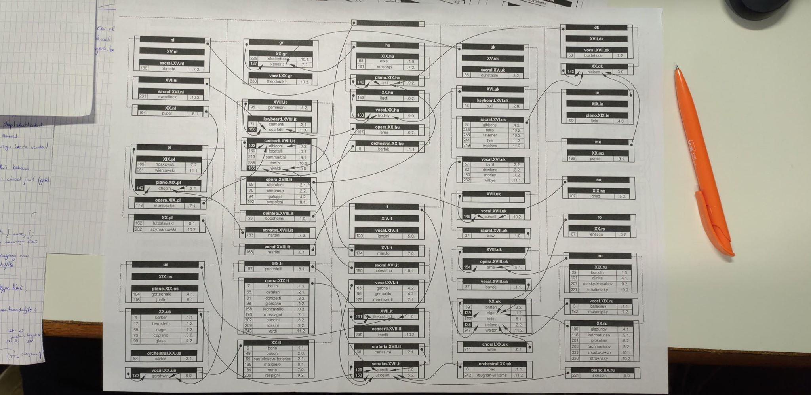

## Labo 1

In dit labo proberen we uit te pluizen hoe we DNS configureren in een groot netwerk:



Onze job is om xenakis te configureren in de zone van Griekenland. Xenakis is verantwoordelijk voor de zone van Griekenland, Hongarije en United Kingdom.

#### resolv.conf

Met `vim /etc/resolv.conf`komen we in het configuratiebestand terecht om te zeggen naar welke Nameserver we onze DNS-requests moeten sturen. In dit geval is Xenakis verantwoordelijk voor zichzelf, dus zetten we hieer 0.0.0.0 of zijn eigen IP-adres in.

```bash
options timeout:1 attempts:1
search iii.hogent.be
nameserver 192.168.16.16
nameserver 192.168.16.13
```

De tweede entry is voor de backup nameserver, als de eerste niet beschikbaar is.

#### named.conf

De verschillende zone's waar Xenakis voor verantwoordelijk is moeten in `/var/named.conf` geconfigureerd worden. 

Het eerste wat in deze file moet zijn de options, hierin komen de verschillende mappen en files waar we onze zone configuraties uiteindelijk zetten, maar ook de extra uitleg die gegenereerd wordt.

``````bash
options {
	directory "/var/named";
	dump-file "/var/named/data/cache_dump.db";
        statistics-file "/var/named/data/named_stats.txt";
        memstatistics-file "data/named_mem_stats.txt";
        empty-zones-enable no;
};
``````

Het volgende is de logging entry, dit wordt enkel gebruikt wat we willen doen met de log en messages, voor als er iets misloopt met de named service. Hier gebruiken we de default syslog van de named daemon. Hierachter komt direct de controls, die worden gebruikt om enkele verschillende controle opties aan te passen. Ik denk dat we hier aanduiden welke subnet adressen mogen gebruik maken van de DNS service van Xenakis.

``````bash
logging
{
        channel default_debug {
                syslog daemon;
                severity dynamic;
        };
};

controls {
	inet * allow { localhost; 192.168.16/24; } keys { rndckey; };
};
``````

De overkoepelende zone is '.' waarvoor xenakis niet de rootserver is, dus zetten we hier type hint. De verschillende root servers van deze zone komen nu in named.ca, die we verder onderaan in deze file gaan aanmaken.

``````bash
zone "." IN {
	type hint;
	file "named.ca";
};
``````

Zoals in het begin werd aangegeven, is Xenakis verantwoordelijk voor drie zone's: Griekenland, Hongarije en United Kingdom. Voor iedere zone gaan we een entry in `named.conf` moeten voorzien. Voor iedere zone is Xenakis telkens de master server en maken we een zone specifieke configuratie bestand aan met dezelfde naam als de zone. Geen idee waarom we bij de hu zone `notify yes;` gebruiken.

``````bash
zone "gr" IN { 
	type master;
	file "gr";
	allow-update {none;};
};

zone "hu" IN {
	type master;
	file "hu";
	allow-update {none;};
	notify yes;
};

zone "uk" IN {
	type master;
	file "uk";
	allow-update {none;};
};
``````

Op het einde horen nog enkele includes, maar opnieuw geen idee waarvoor dit precies dient.

``````bash
include "/etc/rndc.key";
include "/etc/named.rfc1912.zones";
``````

#### named.ca

In named.ca moet de rootserver komen van zonde '.', we weten dat dit Vivaldi is volgens ons schema, dus maken we twee entries aan in deze file. We maken gebruik van relatieve naamgeving, dus moeten we een NS record hebben en een A record. De eerste kolom staat voor de naam van de zone, tweede kolom staat voor de TTL, 3e kolom voor het type record en 4e kolom voor de verantwoordelijke van de eerste kolom.

``````bash
.							3600000	NS	vivaldi.concerti.XVIII.it.
vivaldi.concerti.XVIII.it.	3600000	A	192.168.16.155
``````

#### gr

In ieder zone specifiek configuratie bestand hebben we een SOA-entry bovenaan, of een Start of Authority record. Dit is de server die de administratieve data bijhoudt van deze zone. In ons geval is dit voor alle zones dus xenakis.XX.gr. 

Bovenaan staat de algemene Time To Live, waar alle servers onderaan dan gebruik van maken, zo moeten we het maar 1 keer neerzetten.

De eerste kolom is de naam van de zone, tweede kolom is Internet, 3e kolom is het type record, 4e kolom is de master server van de eerste kolom. Bij een A-record is dat dus gewoon het IP-adres, omdat we willen gebruik maken van relatieve naamgeving. De rest van de SOA lijn bevat een heleboel timestamps, er is aangegeven ernaast voor wat het dient. Aan alle zone namen wordt .gr toegevoegd!

``````bash
$TTL 60
@ 						IN 	SOA xenakis.XX.gr. MAIL (
												131244585 	;serial
												60			;refresh
												15			;retry
												15			;expire
												60  )		;min TTL
						IN NS	xenakis.XX
shalkottas.XX			IN	A	192.168.16.225
xenakis.XX				IN	A	192.168.16.127
theodorakis.vocal.XX	IN	A	192.168.16.238
``````

#### hu

Het configuratiebestand is ongeveer hetzelfde als het vorige, met het verschil dat hu nog een kindobject heeft (de stippelijn op het netwerkblad). De kindzone van hu is XX.hu, met als master nameserver kodaly. Het enigste wat we dus toevoegen is de master/root nameserver van de kindzone. Dit zijn de laatste twee lijnen, opnieuw een A record om het IP-adres te specifieren en dan een NS record om de root nameserver van XX.hu te specifieren.

``````bash
$TTL 60
@ 				IN 	SOA xenakis.XX.gr. MAIL (
										131244585
										60
										15
										15
										60  )
				IN NS	xenakis.XX.gr.
erkel.XIX		IN	A	192.168.16.88
mosonyi.XIX		IN	A	192.168.16.181
kodaly.vocal.XX	IN	A	192.168.16.138
XX				IN	NS	kodaly.vocal.XX
``````

#### uk

Het principe hier is hetzelfde als Hongarije, met het verschil dat de zone uk 4 kindobjecten heeft, namelijk de zone's: XVI, XVII, XVIII en XX. Opnieuw zal voor elke van deze kindzones de master nameserver worden toegevoegd met zijn IP-adres in een A record, en dan een NS-record voor de volledige kindzone met zijn master-name server in de 4e kolom.

``````bash
$TTL 60
@ 					IN 	SOA xenakis.XX.gr. MAIL (
											131244585
											60
											15
											15
											60)
					IN	NS	xenakis.XX.gr.
dunstable.sacral.XV	IN	A	192.168.16.85
XVI					IN	NS	kodaly.vocal.XX.hu.
purcell.vocal.XVII	IN	A	192.168.16.146
XVII				IN	NS	purcell.vocal.XVII
arne.opera.XVIII	IN	A	192.168.16.154
XVIII				IN	NS	arne.opera.XVIII
elgar.XX			IN	A	192.168.16.129
XX					IN	NS	elgar.XX
``````

#### Controle

Vanop Xenakis kunnen we nu onze zone's uittesten met het volgende commando:

``````bash
dig 	axfr 	<zonenaam> 	<NS eigenaar>

dig 	axfr 	uk 			@192.168.16.127
dig 	axfr 	gr 			@192.168.16.127
dig 	axfr 	hu 			@192.168.16.127
``````

De output hiervan zou ongeveer gelijk moeten zijn als de inhoud van ieder zone configuratie bestand.