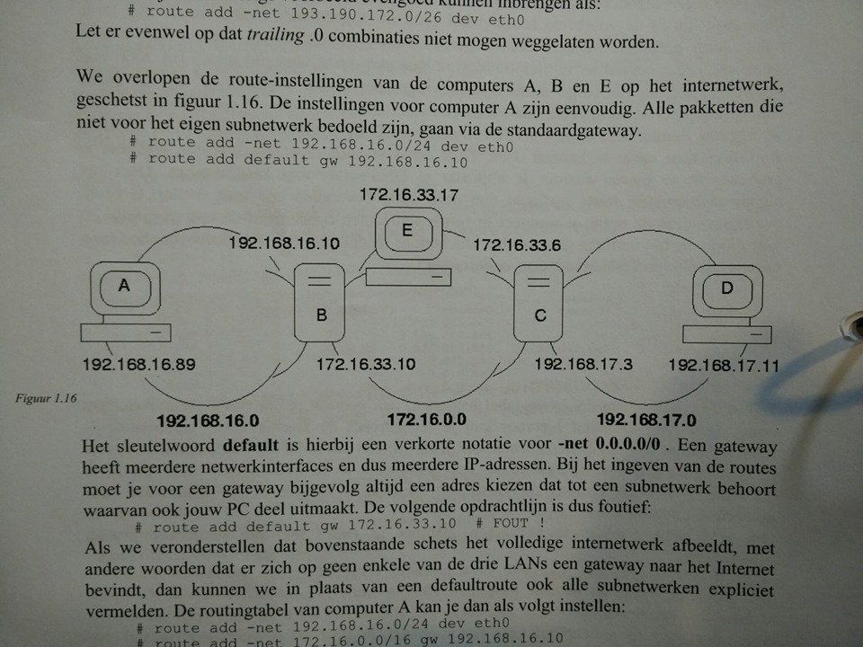

##Labo 3

###Static routing

We gaan een computer omvormen naar een router. Als we het permanent willen aanpassen zullen we dit in sysctl.conf doen, maar dit willen we niet. Daarom gebruiken we `sysctl -w net.ipv4.ip_forward=1`, dit hebben we dynamisch aangepast. (Bij minder recente linux-distributies moet je het bestand `/etc/sysconfig/network` aanpassen en daarin de lijn forward_ipv4=yes zetten) GEEN WHITESPACES

Nu kan onze computer packetjes doorsturen net zoals een router, van zodra de routingtable in orde is gebracht.

Bij static routing stellen we de routingtable manueel in. Zie pagina 11 onderaan. We zullen gebruik maken van het `ifconfig` command om de verschillende interfaces te bekijken van u machine. 

Om een route zelf in te stellen maken we gebruik van het commando `route add -net 192.168.1/24 gw 192.168.1.2  ` . Dit vertelt de computer dat al het netwerkverkeer voor 192.168.1/24 moet verstuurd worden via de router/gateway met het adres 192.168.1.2. Als je -net vergeet, gebruikt hij automatisch de optie -host, dus al het verkeer van een subnetwerk komt dan op 1 computer terecht. Onthoud, dit is enkel voor de huidige sessie van het systeem.

Je kan ook een route toevoegen via een interface: `route -net 192.168.1/24 dev eth0`. Je kan dit ook voor de loopback interface: `route -net 127.0.0.0 netmask 255.0.0.0 dev lo` (waarschijnlijk hetzelfde als `route -net 127/8 dev lo`)



Alle pakketen die niet voor het eigen subnetwerk bedoeld zijn gaan via de default route. 

- Computer A		
  - route add -net 192.168.16.0/24 dev eth0
    - Alle pakketten voor het eigen subnetwerk worden via het interface eth0 verstuurd.
  - route add default gw 192.168.16.10
    - default is ook gelijk aan -net 0.0.0.0/0. Alle pakketten die niet voor het eigen subnetwerk bedoeld zijn worden naar de default gateway gestuurd. Default gateway moet tot hetzelfde subnetwerk behoren waar ook jouw machine (Computer A) deel van uitmaakt.
  - Als we het voorbeeld als gesloten internetwerk beschouwen kunnen we eveneens specifieke pakketjes expliciet vermelden in de routingtable.
    - route add -net 192.168.16.0/24 dev eth0
    - route add -net 172.16.0.0/16 gw 192.168.16.10
    - route add -net 192.168.17.0/24 gw 192.168.16.10
    - route add default reject

- Computer B
  - route add -net 192.168.16.0/24 dev eth0
  - route add -net 172.16.0.0/16 dev eth1
  - route add -net 192.168.17.0/24 gw 172.16.33.6
  - route add default reject
- Computer E
  - route add -net 172.16.0.0/16 dev eth0
  - route add -net 192.168.16.0/24 gw 172.16.33.10
  - route add -net 192.168.17.0/24 gw 172.16.33.6
  - route add default reject
- Computer C & D analoog

Om een route te verwijderen: `route del -net 192.168.17.0/24 gw 172.16.33.6`. 


Er is hier ook een alternatief voor bij recentere distributies met ip route.

```bash
ip route = route
ip route add 0/0 via 172.16.33.17
ip route change 0/0 via 192.168.16.89 (route wijzigen, kan niet bij route)
ip route flush root 0/0 #routing tabel leegmaken
ip route get 193.190.126.71 # om te weten te komen welke route voor een specifiek doeladres genomen wordt
```

####Probleemdiagnose

- ping <ip-adres>

- traceroute en tracert

- pathping (combinatie van ping en traceroute, interessanter dan tracert wanneer je wel verbinding hebt met de eindbestemming, maar op die verbinding veel verlies van pakketten en grote vertraging optreden)

- arpcache (tabel voor de vertaling van ip-adressen naar fysieke subnetwerk adressen, als je denkt dat die verkeerd of foutief is ingesteld, dan moet je die best eens flushen)
  De optie `-d <computernaam> ` om dat uit de arpcache te halen.

  Met`-s <computernaam> <hw-address>` kan je zelf een hardware adres ingeven.

###Dynamic routing

Een routingprotocol zorgt voor de invulling van de routingtable. Er is wel een verschil tussen de routingtable opvullen en 'aan routing doen'. Met andere woorden er wordt niet gezorgd voor het verzenden van pakketjes!

Convergentieperiode = De tijd dat het neemt tegen dat alle routers op de hoogte zijn van wijzigingen in het netwerk. Kan wel voor een cascade van fouten zorgen, dus pas op!

RIP heeft een lange convergentieperiode en veel overhead, maar is redelijk gemakkelijk te implementeren.

OSPF lost deze tekortkomingen op, maar is iets ingewikkelder om te implementeren.

Exterior gateway protocols: EGP, BGPv4, GGP

Interior gateway protocols: RIP, OSPF, EIGRP, IS-IS

Binnen een AS kan je meerdere interior gateay protocols gebruiken, maar de routers weten dat niet van elkaar af. Routers krijgen alleen maar informatie van andere routers die hetzelfde IGP gebruiken. Om dit probleem op te lossen, bestaan er 'Routing Domain Border Routers' die alles weten over de verschillende protocollen. Hierdoor kunnen routers die in een verschillend routing domain zitten, tegen elkaar spreken.

####RIP (Routing Information Protocol)

